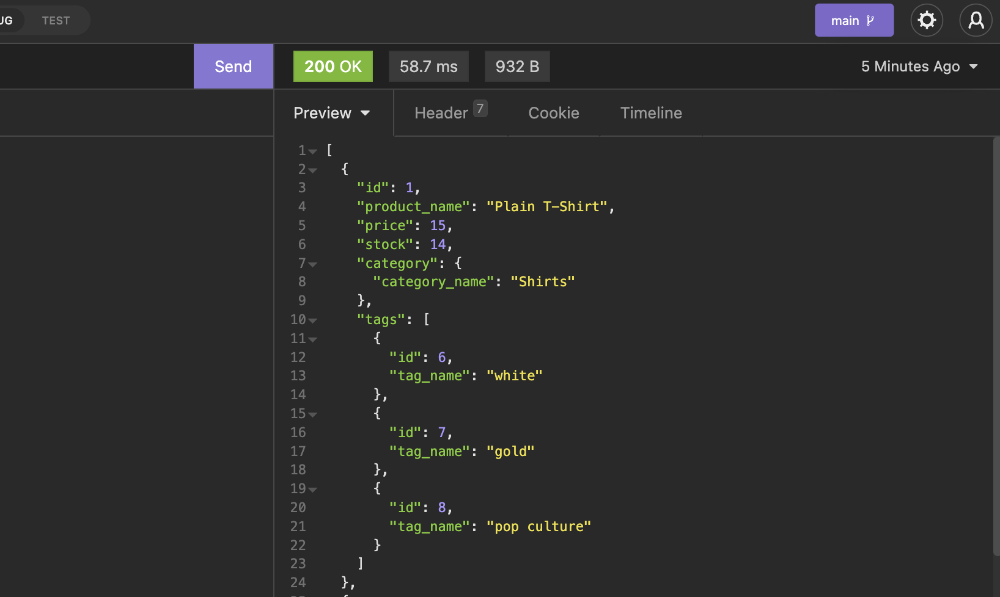

# E-commerce Back End Starter Code

## How to start the app!

    first run in the terminal: node seeds/index.js
    then enter into console: npm start
    then use insomnia to query the database

## contributors

Jack Nowaczewski

## Github

https://github.com/Lil-Chevy/E_Commerce_Backend

## deployed app

https://damp-tundra-23271.herokuapp.com/
